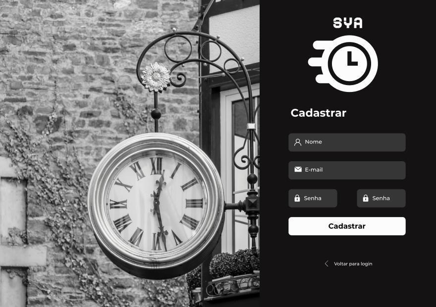
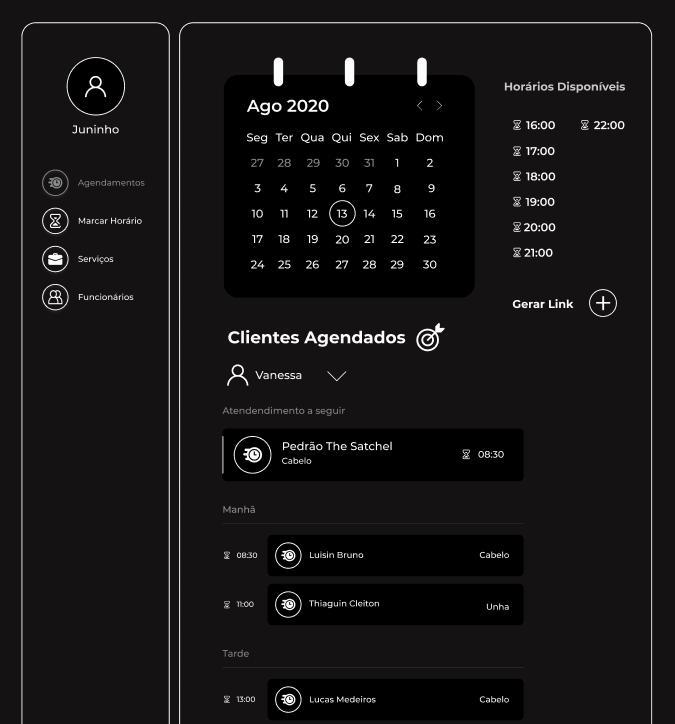
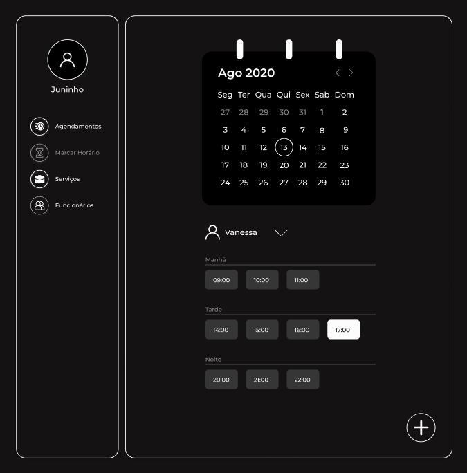
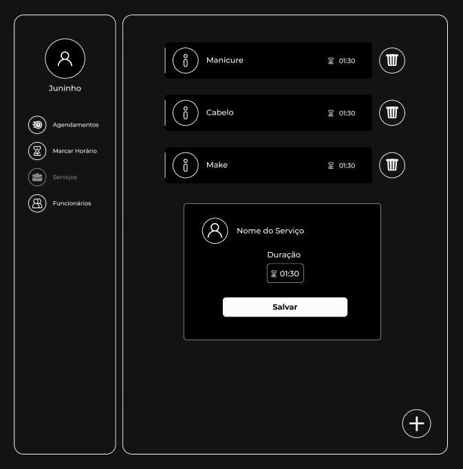
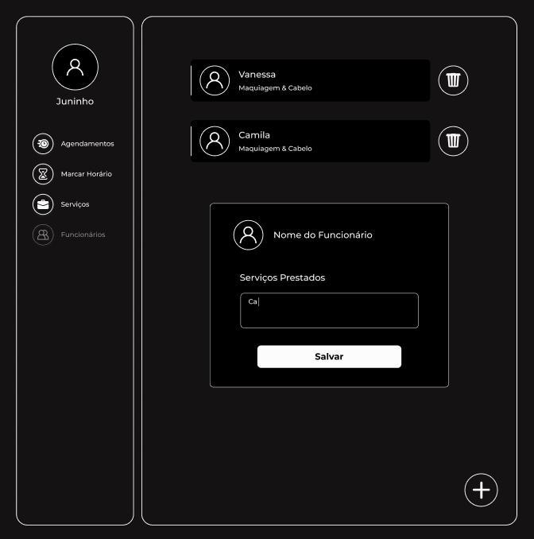

# SYA
**Número do Grupo**: 11<br>
**Código da Disciplina**: FGA0208-T01<br>

## Alunos
|Matrícula | Aluno |
| -- | -- |
| 17/0008371 | [Daniel Sousa Melo](https://github.com/dansousamelo) |
| 17/0016811 | [Lucas Leite Maduro](https://github.com/lucasqmc) |
| 17/0039803 | [Lucas Medeiros](https://github.com/medeiroslucas) |
| 14/0169695 | [Luis Bruno Fidelis](https://github.com/lbrunofidelis) |
| 15/0144474 | [Pedro Queiroz Miranda](https://github.com/pedroMiranda7410) |
| 17/0046176 | [Tiago Miguel](https://github.com/tmcstiago) |

## Sobre 
SYA - Schedule Your Appointment - é um WebApp responsivo para agendamento de clientes em serviços prestados por estabelecimentos. O sistema conta com um link disponibilizado pelo estabelecimento para o agendamento do cliente, sem a necessidade de uma conta, e este pode selecionar o serviço, funcionário, dia e hora em que deseja ser atendido.

## Screenshots

<div style="display: flex; justify-content: center; align-items:center;">
    <br/>
</div>
<p align="center">Login</p>

<div style="display: flex; justify-content: center; align-items:center;">
    
</div>
<p align="center">Cadastro</p>

<div style="display: flex; justify-content: center; align-items:center;">
    
</div>
<p align="center">Marcar Horário</p>

<div style="display: flex; justify-content: center; align-items:center;">
    
</div>
<p align="center">Agendamento</p>

<div style="display: flex; justify-content: center; align-items:center;">
    
</div>
<p align="center">Serviços</p>

<div style="display: flex; justify-content: center; align-items:center;">
    
</div>
<p align="center">Funcionários</p>

<i>
  Obs: Os screenshots são referentes ao Protótipo de Alta Fidelidade.
</i><br/>

## Instalação - Wiki

### Criando ambiente virtual

```bash
$ nodeenv env
```

### Instalação Docsify

```bash
$ source env/bin/activate	# acessando o ambiente virtual
(env)$ npm i docsify-cli -g
```

## Comandos

### Iniciar o servidor Docsify

```bash
(env)$ docsify serve docs
```

Para realizar o deploy basta commitar as modificações


## Uso 
Explique como usar seu projeto caso haja algum passo a passo após o comando de execução.

## Vídeo
<p align="center"><iframe src="https://unbarqdsw.github.io/2020.1_G11_SYA/assets/guia_de_estilo/certo.mp4" frameborder="0" width="600" height="390" allowfullscreen="true"e mozallowfullscreen="true" webkitallowfullscreen="true"></iframe></p>

<i>
  Este vídeo é referente ao Protótipo de Alta Fidelidade.<br/>
  Para visualizar acesse:
  <a href="https://www.figma.com/proto/Bw0ZyS0OWPlpQYDZ6XtB99/SYA?node-id=7%3A2&scaling=min-zoom">
    Figma
  </a>
</i>


## Outros 
Quaisquer outras informações sobre seu projeto podem ser descritas abaixo.
