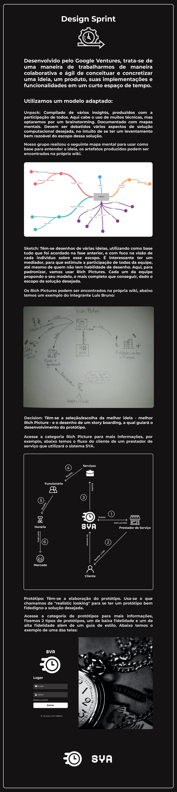

# Definições de Projeto

    

## **Histórico de revisões**
Data | Responsável | Versão | Alteração 
---- | ----------- | ------ | ---------
10/09/2020 | [@dansousamelo](http://github.com/dansousamelo) | 1.0 | Adicionando Definição de Projeto

    

