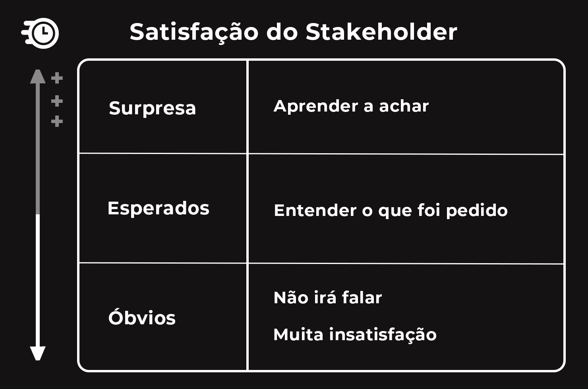
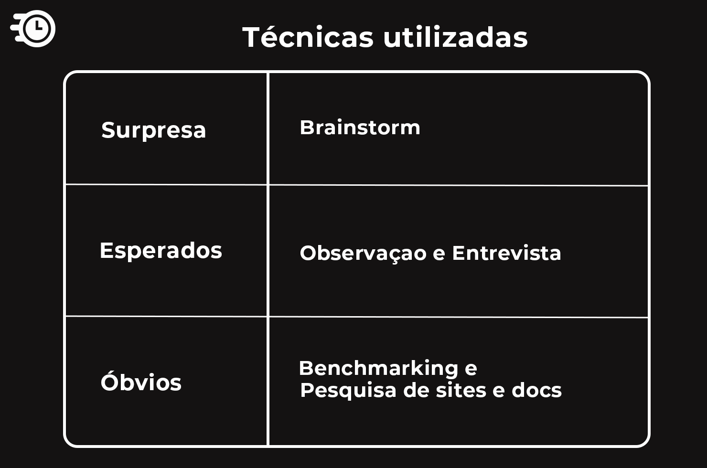

# Metodologia de Elicitação

    

&emsp;Baseado no <b>modelo Kano</b> e no <b>Desdobramento da Função Qualidade (QFD)</b> o grupo preocupou-se em levantar os requisitos categorizando-os de acordo com a satisfação de um stakeholder.

## Histórico de Versões

| Data | Versão | Descrição | Autor(es) |
| ---- | ------ | --------- | --------- |
| 08/09/2020 | 1.0 | Adicionando metodologia | Daniel Sousa ([@dansousamelo]((https://github.com/dansousamelo)))  e Luis Bruno ([@lbrunofidelis](https://github.com/lbrunofidelis)) |

&emsp;Na imagem abaixo podemos ver três categorias, categoria de requisitos surpresa, esperados e óbvios.

    

    <i>
Categorização dos requisitos, a seta a esquerda simboliza o grau de satisfação do stakeholder.
</i>

&emsp;<b>Requisitos Esperados:</b> São requisitos fundamentais no sistema, deve-se entender o que foi pedido. Se esses requisitos estiverem no sistema, deixarão o stakeholder satisfeito, pois o sistema propõe o que foi pedido.

&emsp;<b>Requisitos Surpresas:</b> São aqueles requisitos que o stakeholder não solicitou, mas você como engenheiro de requisitos estudou muito bem a ideia, deve-se aprender a achar, e propôs além dos requisitos esperados, deixando o stakeholder mais satisfeito ainda.

&emsp;<b>Requisitos Óbvios:</b> São aqueles requisitos óbvios para o stakeholder, mas para quem irá desenvolver não. Se não entregarmos esses requisitos causará muita insatisfação ao cliente.

&emsp;A partir dos conceitos apresentados, o grupo procurou realizar as seguintes técnicas para elicitar requisitos da melhor forma possível. A imagem abaixo retrata as técnicas utilizadas.

    

    <i>
Técnicas utilizadas.
</i>

&emsp;Para os requisitos surpresas utilizamos o brainstorm, uma técnica que necessita amplamente da criatividade.

&emsp;Já nos requisitos esperados, tentamos fazer a melhor entrevista possível, passando pelo método da observação.

&emsp;Em relação aos requisitos óbvios, utilizamos documentos e comparamos com outras aplicações para levantar conceitos básicos acerca do mundo dos agendamentos.

## Para saber mais

&emsp;<b>Modelo Kano:</b> No Modelo de Kano é defendido que para alguns atributos do produto e/ou serviço, a satisfação do cliente é aumentada drasticamente com somente uma pequena melhoria no desempenho, quando para outros atributos, a sua satisfação aumenta pouquíssimo quando o desempenho é melhorado ao extremo. Por exemplo, um cliente pode avaliar o ar condicionado como um peso de 25% na escolha do apartamento e não pode estar totalmente satisfeito com o apartamento mesmo se o ar condicionado funciona perfeitamente (SAUERWEIN et al., 1996). Normalmente o modelo é aplicado para a classificação de atributos da qualidade; a idéia fundamental do modelo é que os atributos do produto e/ou serviço podem ser Associação Brasileira de Engenharia de Produção - ABEPRO Universidade Federal de Santa Catarina - UFSC www.producaoonline.org.br ISSN 1676 - 1901 / Vol. IX/ Num.lII/ 2009 539 classificados em categorias conforme eles criam satisfação ou insatisfação com um nível de desempenho (HUISKONEN e PIRTTILÄ, 1998).

&emsp;<b>Desdobramento da Função Qualidade (QFD):</b> De maneira simplificada, o QFD tem como objetivo “ouvir” a voz do cliente e ordená-la de modo a facilitar a análise de suas necessidades, que são transformadas em requisitos para a melhoria do produto/serviço na forma de especificações técnicas do mesmo. Ou seja, traduzir a “voz dos clientes‟ para a voz dos engenheiros‟” (AKAO, 1996).

## Referências
 * 
ELICITAÇÃO de Requisitos de Software - Mini Curso. Produção: Roberto Sabino. [S. l.: s. n.], 2018. Disponível em: https://www.udemy.com/share/101CgSBUQYeFlTTHw=/. Acesso em: 2 set. 2020.

 * 
RIBEIRO, J. L. D.; ECHEVESTE, M. E. & DANILEVICZ, A. M. F. A Utilização do QFD na Otimização de Produtos, Processos e Serviços. Série Monográfica Qualidade. Porto Alegre: UFRGS, 2000.

 * 
ROOS, CRISTIANO; SARTORI, SIMONE; GODOY, LEONI PENTIADO. Modelo de KANO para a identificação de atributos capazes de superar as expectativas do cliente. Revista produção online, v. 9, n. 3, 2009.

 * 
PRESSMAN, Roger S. Engenharia de Software uma abordagem profissional. 7ª edição. ed. [S. l.: s. n.], 2016.

