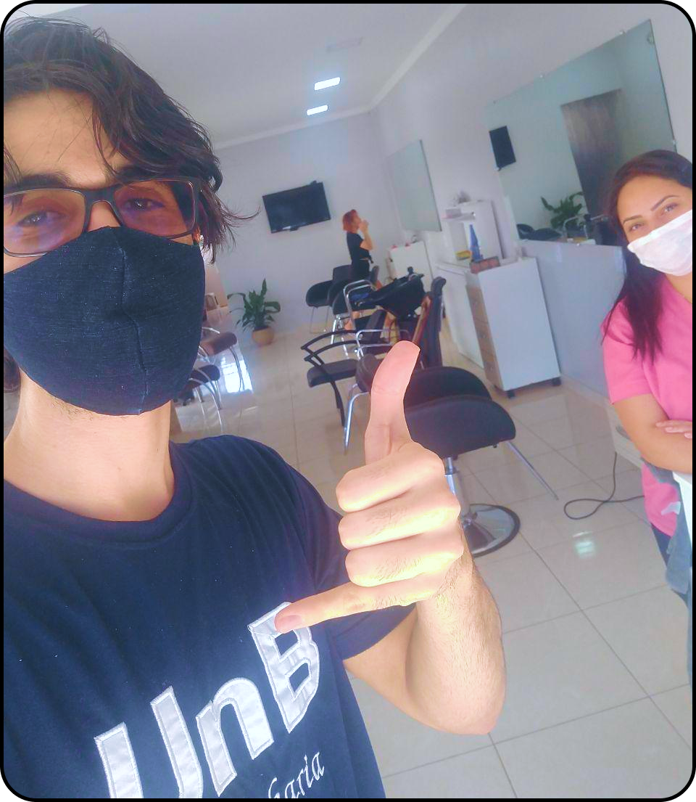
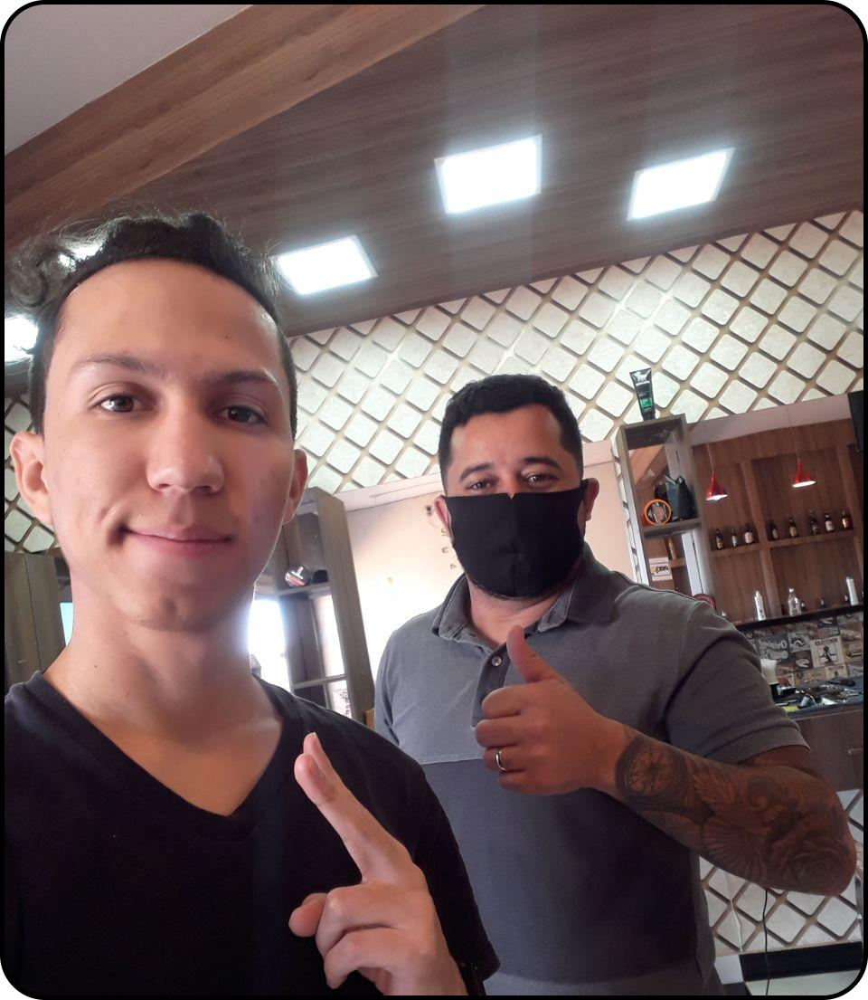
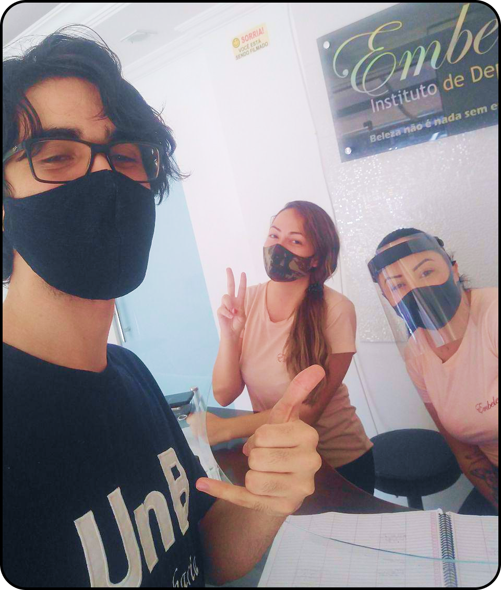

# Requisitos Esperados

## Observação

    

&emsp;A técnica de observação, como o próprio nome sugere, consiste em observar o problema e tentar entendê-lo, visitando o local em foco com a finalidade de observação do mesmo. Permitindo assim, coletar informações de acordo com o cotidiano das operações e execução dos processos diários do local.

&emsp;Procuramos ir em lugares em que um agendamento é necessário, abaixo temos os nossos ambientes de observação:

## Histórico de Versões

| Data | Versão | Descrição | Autor(es) |
| ---- | ------ | --------- | --------- |
| 02/09/2020 | 1.0 | Elicitando Requisitos Esperados | Daniel Sousa ([@dansousamelo]((https://github.com/dansousamelo)))  e Luis Bruno ([@lbrunofidelis](https://github.com/lbrunofidelis)) |
| 08/09/2020 | 1.1 | Revisão dos Requisitos | Lucas Medeiros ([@medeirosLucas](https://github.com/medeiroslucas)) e Tiago Miguel ([@tmcstiago](https://github.com/tmcstiago)) |
| 09/09/2020 | 1.2 | Ajustando formatação | Daniel Sousa ([@dansousamelo]((https://github.com/dansousamelo))) |

### Griffe Da Beleza

    

    <i>
@griffedabeleza_g
</i>

&emsp;O integrante do grupo Daniel foi até um centro de medicina e estética observar como era feito o agendamento, o mesmo observou:

&emsp;<i>“Observando e conversando informalmente com uma das balconistas, Solange, ele me contou que os agendamentos ou eram via aplicativo de mensagem ou por ligação telefônica, esse esses são registrados em um caderno.  A balconista me contou também que em dias com a agenda muito cheia ficava um pouco difícil de lidar  com a demanda”.</i>

    

    <i>
Data da visita: 02/09/2020
</i>

### El Conde Barber

    

    <i>
@elcondebarber
</i>

&emsp;O integrante do grupo Luís Bruno foi até uma barbearia observar como funcionava o sistema de agendamento, e o mesmo observou:

&emsp;<i>“O barbeiro, Gilson, em conversa informal, contou que eles utilizam um software no computador para agendamento. Os clientes ligam ou enviam mensagem para eles e então os funcionários salvam no computador o nome do cliente e o horário marcado. Porém, ultimamente esse sistema de agendamento não tem sido muito utilizado por conta de obras na rua e até pela pandemia, que diminuiu bastante o movimento na barbearia.”</i>

    

    <i>
Data da visita: 02/09/2020
</i>

### Embeleze Medicina & Estética

    

    <i>
@embelezegama
</i>

&emsp;Outro lugar, que o integrante do grupo Daniel observou como os agendamentos funcionam, foi em um centro de medicina e estética. Nele pode-se observar:

&emsp;<i>“Pude observar que os agendamentos são feitos via aplicativo de mensagem e feito também através de ligações telefônicas. Vale salientar que as balconistas registram os horários em um caderno. Outro fator interessante é o lugar possuir uma interface que leva o cliente até o número de contato da embeleze.”</i>

    

    <i>
Data da visita: 02/09/2020
</i>

## Requisitos Esperados Levantados

1. O sistema deve ser capaz de cadastrar um funcionário;
1. O sistema deve ser capaz de cadastrar um serviço;
1. O sistema deve ser capaz de cadastrar um agendamento de um serviço referente a um único usuário;
1. O usuário deve ser capaz de criar o seu agendamento selecionando um funcionário e um serviço;
1. O sistema deve gerar um link que será enviado para o usuário realizar o agendamento;
1. O sistema deve ser capaz de mostrar para um funcionário a agenda diária, semanal e mensal;
1. O sistema deve possuir um modelo conceitual do banco de dados;
1. O sistema deve possuir realizar restrição de acesso para funcionários.

## **Referências**
 * 
ELICITAÇÃO de Requisitos de Software - Mini Curso. Produção: Roberto Sabino. [S. l.: s. n.], 2018. Disponível em: https://www.udemy.com/share/101CgSBUQYeFlTTHw=/. Acesso em: 2 set. 2020.

