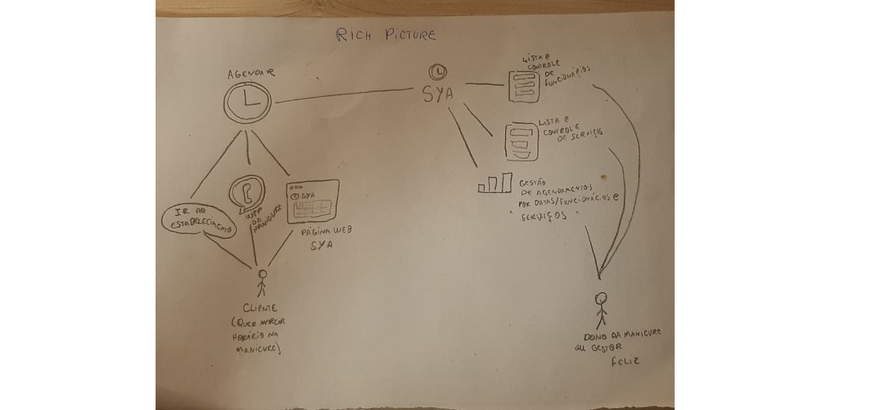
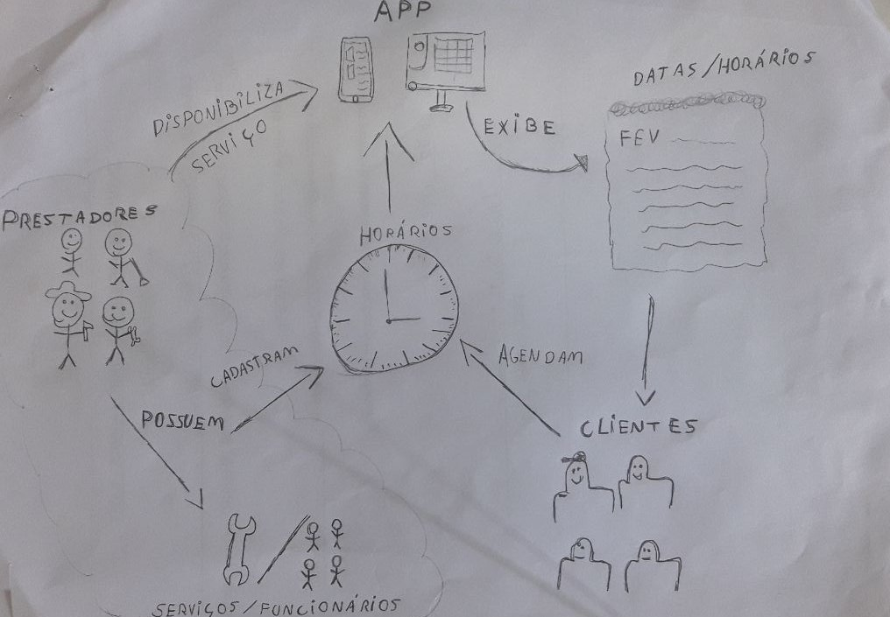
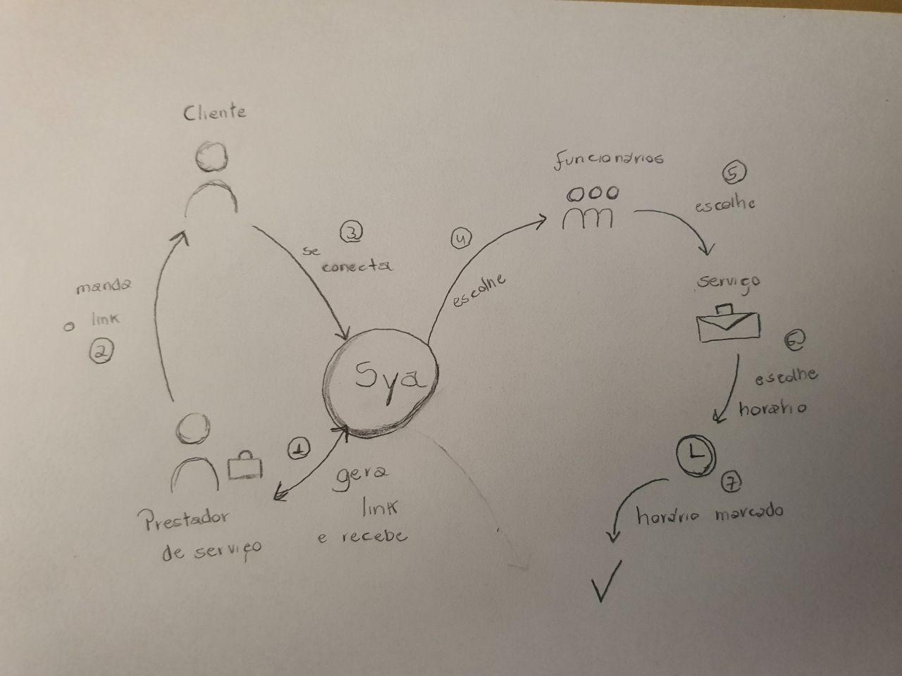
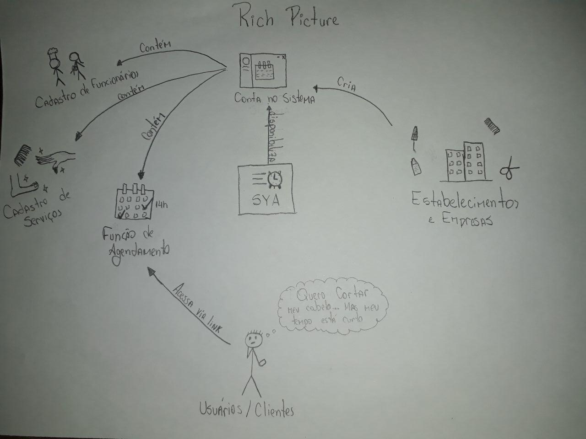
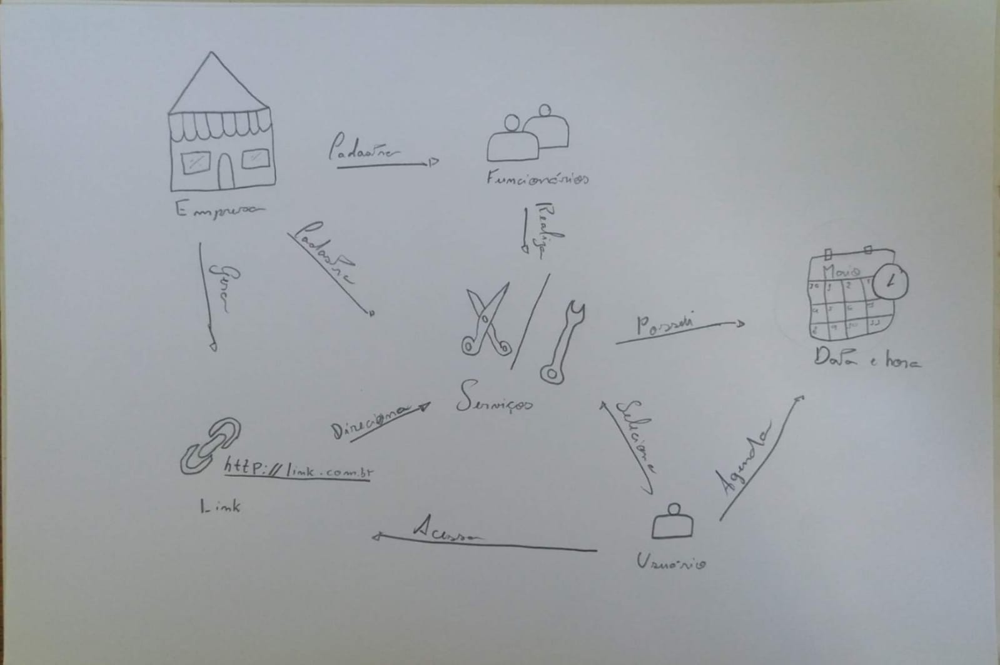
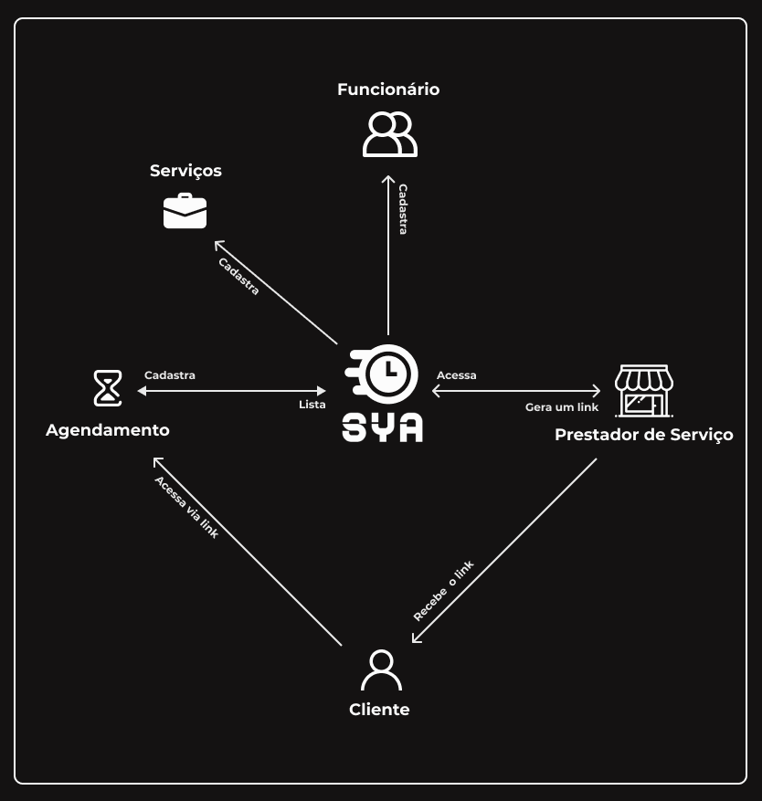
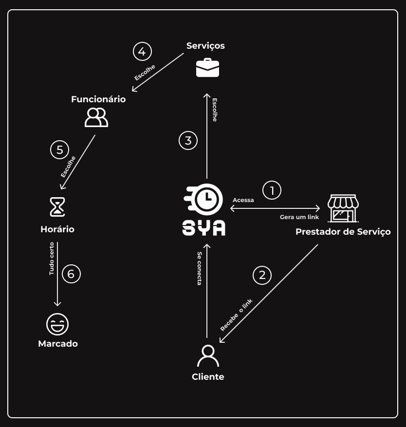

# **Rich Picture**

    

&emsp;O Rich Picture é um modelo que explora o máximo de elementos e relações entorno de uma certa situação, desta forma, é possivel constatar aspectos que antes passariam despercebidos pelo time.

&emsp;Inicialmente cada participante do grupo ficou responsável por fazer o Rich Picture de um aplicativo específico, após a seleção do aplicativo o time se reuniu para produzir uma nova versão do documento com pontos mais detalhados e com mais informações do aplicativo.

## Histórico de Versões

| Data | Versão | Descrição | Autor(es) |
| ---- | ------ | --------- | --------- |
| 02/09/2020 | 1.0 | Criação do documento sobre Rich Pictures e subindo Rich Picture do Pedro e Do Lucas Leite | Pedro Miranda ([@pedroMiranda7410]((https://github.com/pedroMiranda7410)))  e Lucas Leite ([@lucasqmc](https://github.com/lucasqmc)) |
| 08/09/2020 | 1.1 | Adicionando Rich Picture do Daniel, Luis e Medeiros| Daniel Sousa ([@dansousamelo]((https://github.com/dansousamelo)))|
| 10/09/2020 | 1.2 | Adicionando V2 Rich Picture fluxo geral e cliente| Daniel Sousa ([@dansousamelo]((https://github.com/dansousamelo)))|

## RP - V1
### Pedro Miranda

### Lucas leite

### Daniel de Sousa

### Luis Bruno

### Lucas Medeiros

## RP - V2
### Rich Picture - Fluxo Geral

### Rich Picture - Fluxo Cliente

## Referências
 * 
SERRANO, Maurício; SERRANO, Milene; Requisitos - Aula 4; Disponível em https://aprender.ead.unb.br/pluginfile.php/706393/mod_resource/content/1/Requisitos%20-%20Aula%2004.pdf.

